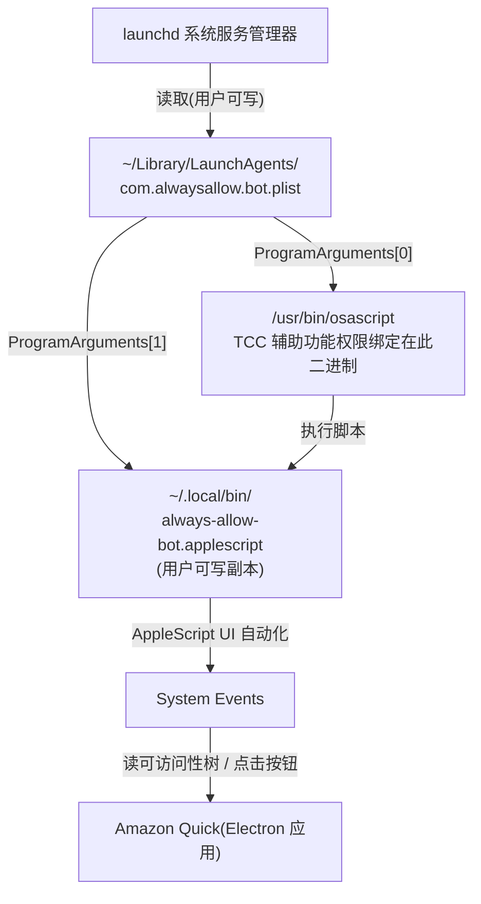
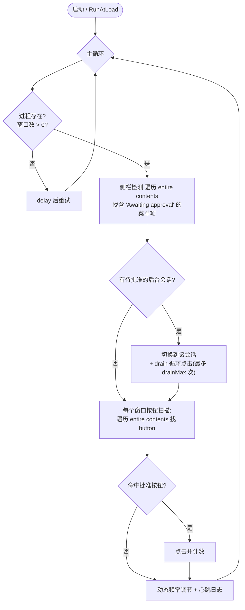
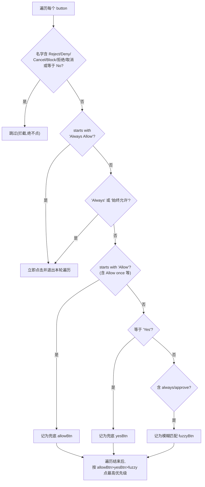

# AlwaysAllow Bot — Amazon Quick 自动批准 (s2 版本)

自动点击 **Amazon Quick**(基于 Electron 的桌面应用)中反复弹出的权限确认按钮(`Always Allow` / `Always` / `Allow once` / `Yes` 等),让 CodeAgent 等会话无需人工逐个批准。通过 macOS `launchd` 常驻后台运行。

---

## 1. 项目文件

| 文件 | 说明 | 实际部署位置 |
| --- | --- | --- |
| `always-allow-bot.applescript` | 主逻辑(AppleScript UI 自动化) | `~/.local/bin/always-allow-bot.applescript` |
| `com.alwaysallow.bot.plist` | launchd 服务定义(开机自启、常驻) | `~/Library/LaunchAgents/com.alwaysallow.bot.plist` |
| `README.md` | 本说明文档 | — |

> 运行时日志:`/tmp/always_allow_log.txt`

---

## 2. 架构:免密(无需 sudo)方案

原脚本位于 root 所有的 `/usr/local/bin/`,改动需要 `sudo`。s2 改为**只动用户自己可写的两样东西**,全程绕开 root:

- 脚本副本放到家目录 `~/.local/bin/`(用户可写)
- launchd 服务定义 `~/Library/LaunchAgents/*.plist`(用户可写)指向该副本



**为什么免密成立**

1. launchd 启动哪个脚本由 plist 的 `ProgramArguments` 决定,而 plist 在家目录、用户可写。
2. macOS 的辅助功能(Accessibility / TCC)权限**绑定在执行二进制 `/usr/bin/osascript` 上,而非脚本路径**;`ProgramArguments[0]` 仍是 osascript,所以换脚本路径后**无需重新授权**。
3. root 所有的原文件完全不碰。

---

## 3. 工作流程



### 按钮匹配优先级



---

## 4. s2 本次全部改动

### 4.1 修复:目标进程错误(根因)

脚本原本盯着进程名 `Kiro`,但该进程是**后台进程、0 窗口**;真正的桌面 UI(审批弹窗所在)是 **`Amazon Quick`** 进程。导致脚本一直空转、从不点击。

```applescript
- set TARGET_APP_NAME to "Kiro"
+ set TARGET_APP_NAME to "Amazon Quick"
```

### 4.2 修复:`Allow once` 点不到

批准按钮实际叫 `Allow once`,而脚本对 Allow 是**精确匹配** `is "Allow"`,导致漏点。改为前缀匹配(两处),可覆盖 `Allow once` / `Allow always` / `Allow for this chat`,且不误伤 `Deny`、不与 `Always Allow` 冲突。

```applescript
- else if btnName is "Allow" then
+ else if btnName starts with "Allow" then
```

### 4.3 优化:降低 drain 重扫次数

```applescript
- set drainMax to 20
+ set drainMax to 2
```

单个会话被反复全树重扫的次数从最多 20 次降到 2 次,杜绝分钟级卡顿。

### 4.4 优化:封顶空闲退避延迟

空闲轮询间隔上限从 5s / 2s 收敛到 1s,避免"越闲越慢":

```applescript
  if idleRounds ≥ 200 then
-     set currentDelay to 5
+     set currentDelay to 1
  else if idleRounds ≥ 50 then
-     set currentDelay to 2
+     set currentDelay to 1
  else if idleRounds ≥ 10 then
      set currentDelay to 1
```

### 4.5 配置:Amazon Quick 模型版本

`acp_agents.json` 里 `kiro-cli-chat`(acp-kiro)代理的模型由旧版升级:

- 文件:`~/.quickwork/profiles/enterprise-e8a54e0fd20e/acp_agents.json`
- 字段:`preset_config.model`

```diff
- "model": "anthropic:claude-opus-4-6"
+ "model": "anthropic:claude-opus-4-8"
```

> 注:该字段为单值字符串,只支持一个模型,本质是替换而非并列追加。

---

## 5. 性能实测与硬限制

针对 Amazon Quick 窗口(可访问性树约 233 元素、56 个按钮)实测:

| 操作 | 耗时 | 结论 |
| --- | --- | --- |
| `entire contents`(仅取引用) | ~0.16s | 调用本身很快(惰性) |
| 全树遍历 + 逐元素读 class/name | **~7–10s** | **瓶颈**:逐元素 Apple Event 往返 |
| `buttons of window 1`(直接子级) | ~0.15s | 仅 3 个且多为空名,**漏掉深层审批按钮** |
| 深层 `whose` 过滤查询 | 立即 **-1700 报错** | **不可行**(Electron 不支持) |

**硬限制**:审批按钮深埋在 Electron 树中,只能靠全树遍历定位;深层 `whose` 定向查询在 Amazon Quick 上确认报 `-1700`。因此**单次扫描 ~7–10s 是 macOS AX 对 Electron 的硬下限**,无法通过定向查询绕开。

**s2 优化效果**:反应时间从"最坏 ~20s+(5s 退避 + 最多 20 次 drain 重扫)"降到"≈ 一次扫描(7–10s) + ≤1s 轮询"。

**已知可选的进一步提速(未做,有回归风险)**:每轮目前对 `window 1` 做了两次全树遍历(侧栏检测 + 按钮扫描),合并为单次遍历可再省约一半(~5s 级)。

---

## 6. 部署与运维

### 安装(免密)

```bash
# 1. 放置脚本副本(目标进程已设为 Amazon Quick)
mkdir -p ~/.local/bin
cp always-allow-bot.applescript ~/.local/bin/always-allow-bot.applescript

# 2. 放置服务定义
cp com.alwaysallow.bot.plist ~/Library/LaunchAgents/com.alwaysallow.bot.plist

# 3. 加载启动
launchctl load ~/Library/LaunchAgents/com.alwaysallow.bot.plist
```

> **路径说明**:仓库内 `com.alwaysallow.bot.plist` 默认使用 `/usr/local/bin/always-allow-bot.applescript`(需 `sudo` 安装到该处)。
> 若用**免密方案**(脚本放 `~/.local/bin/`),需把 plist 里的脚本路径改成你自己的**绝对路径**,例如 `/Users/你的用户名/.local/bin/always-allow-bot.applescript`——**launchd 不展开 `~`**,必须写全路径。

> 首次需在「系统设置 → 隐私与安全性 → 辅助功能」中允许 `osascript`(`/usr/bin/osascript`)。

### 常用命令

```bash
# 状态(显示 PID 与最后退出码)
launchctl list | grep alwaysallow

# 重启(改动脚本后让其生效)
launchctl unload ~/Library/LaunchAgents/com.alwaysallow.bot.plist
launchctl load   ~/Library/LaunchAgents/com.alwaysallow.bot.plist

# 看实时进程
pgrep -fl always-allow-bot

# 看日志
tail -f /tmp/always_allow_log.txt

# 语法检查
osacompile -o /dev/null ~/.local/bin/always-allow-bot.applescript && echo OK
```

> 服务带 `RunAtLoad=true` + `KeepAlive=true`,登录即自启、挂掉自动重拉。

### 日志含义

```
[时间] 心跳 | 轮: 循环次数 | 点击: 累计点击 | 切换: 会话切换数 | 错误: 累计错误 | 频率: 当前轮询间隔
[时间] 切换到: <会话名> Awaiting approval
[时间] #N 点击(后台): <按钮名>
```

- `错误: 0` 且心跳持续增长 = 健康运行。
- 出现 `osascript is not allowed assistive access` = 辅助功能权限未授予/未生效。

---

## 7. 安全说明

- 脚本**只点批准类按钮**,并显式拦截 `Deny/Reject/Cancel/Block/拒绝/取消/No`。
- 本质是"无条件自动批准",会自动放行权限请求;请确认你信任所运行的 Agent 任务,避免在不可信内容场景下使用。
